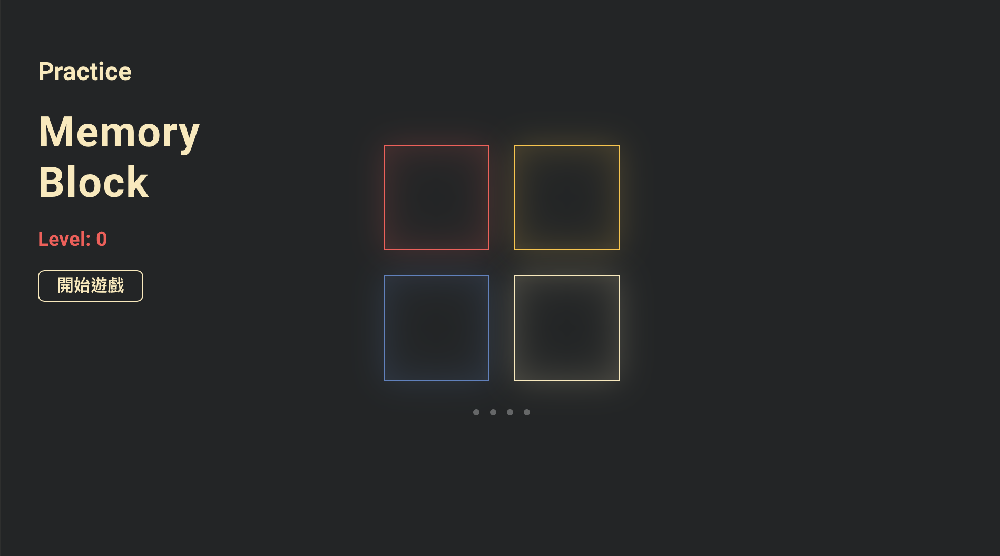

<h1 align="center">MemoryBlock</h1>

    
    
    
    

    Project：<a href="https://github.com/evilz0212/ex-js-memoryblock/">Github</a>
	Demo：<a href="https://evilz0212.github.io/ex-js-memoryblock/">Git Pages</a>

## Overview
> JS 節奏記憶小遊戲，跟著提示點擊相同順序的方塊，失誤將回到第一關重新開始

-   ES6：prototype \ class 物件導向、import \ export 模塊化、字串模板語法
-   vite：全局載入樣式、打包編譯路徑
-   git：上傳 gh-pages 分支（git subtree split）
-   sass：變數 \ 組件樣式管理
-   html5：audio 標籤操作、音檔支援度標示（audio/x-wav）、Web Audio API（互動延遲）
